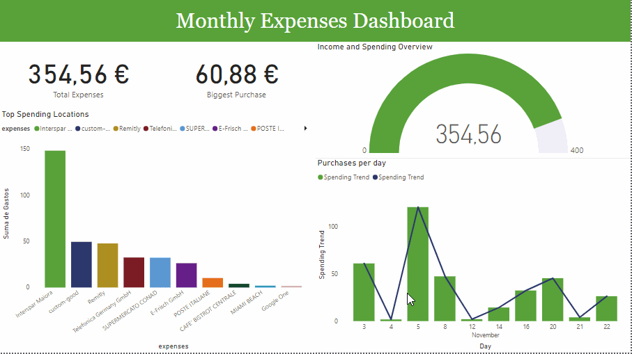

# Data Portfolio: Excel to PowerBI

## Objective: Empowering Financial Decision-Making Through Data Visualization  

### Key Point  
The client is seeking clarity on their financial habits, particularly for the month of November. They require a clear and comprehensive visualization of their spending patterns to better manage their savings and improve financial decision-making.  

### Proposed Solution  
Develop a data-driven dashboard that provides actionable insights into the client’s monthly expenditures. The dashboard will include:  

- **Total Income and Expenditure**: A snapshot of the client’s financial balance for the month.  
- **Daily Spending Trends**: A breakdown of daily expenditures to identify patterns and anomalies.  
- **Major Spending Categories**: An analysis of where the client allocates the majority of their funds.  
- **Largest Expenses**: A detailed view of significant outlays to help prioritize budgeting adjustments.  

By delivering these insights, the dashboard will enable the client to make informed and strategic decisions to optimize their budget and savings.

## Data Source  

### Data Requirements  
To achieve the objective of providing actionable financial insights, the following data is required for the month of November:  
- **Total Income and Total Expenses**: A summary of the client’s overall financial activity.  
- **Daily Expenses**: Detailed transactions to analyze spending trends on a day-to-day basis.  
- **Spending Categories**: Detailed information on where the client’s money is spent.

### Data Origin  
The data is sourced directly from the client’s **N26 account**, ensuring accurate and up-to-date financial records for analysis. 


## Tools Used


<table style="width:100%; border-collapse: collapse; text-align: left; font-family: Arial, sans-serif;">
  <thead>
    <tr style="background-color: #f4f4f4; border-bottom: 2px solid #ddd;">
      <th style="padding: 10px; border: 1px solid #ddd;">Tool</th>
      <th style="padding: 10px; border: 1px solid #ddd;">Purpose</th>
    </tr>
  </thead>
  <tbody>
    <tr>
      <td style="padding: 10px; border: 1px solid #ddd;">Excel</td>
      <td style="padding: 10px; border: 1px solid #ddd;">Exploring the data</td>
    </tr>
    <tr style="background-color: #f9f9f9;">
      <td style="padding: 10px; border: 1px solid #ddd;">SQL Server</td>
      <td style="padding: 10px; border: 1px solid #ddd;">Cleaning, testing, and analyzing the data</td>
    </tr>
    <tr>
      <td style="padding: 10px; border: 1px solid #ddd;">Power BI</td>
      <td style="padding: 10px; border: 1px solid #ddd;">Visualizing the data via interactive dashboards</td>
    </tr>
    <tr style="background-color: #f9f9f9;">
      <td style="padding: 10px; border: 1px solid #ddd;">GitHub</td>
      <td style="padding: 10px; border: 1px solid #ddd;">Hosting the project documentation and version control</td>
    </tr>
    <tr>
      <td style="padding: 10px; border: 1px solid #ddd;">Mokkup AI</td>
      <td style="padding: 10px; border: 1px solid #ddd;">Designing the wireframe/mockup of the dashboard</td>
    </tr>
  </tbody>
</table>

## Stages
- Design
- Development
- Testing
- Analysis

## Design

### Dashboard Mockup  

To effectively address the client's requirements and present actionable insights, the following data visualizations are proposed for the dashboard:  

- **Bar Chart**
- **Gauge Chart**
- **Line and Column Chart**
- **Scorecards**


## Development

### Process
1. Get the data
2. Explore the data in Excel
3. Load the data into SQL Server
4. Clean the data with SQL
5. Test the data with SQL
6. Visualize the data in Power BI
7. Generate findings based on the insights

### Data exploration notes

From the provided dataset, I only need the following four columns, as they are relevant to the analysis:

- **Booking Date**: The date of the transaction.
- **Partner Name**: The recipient of the funds.
- **Account Name**: The source of the funds.
- **Amount (EUR)**: The transaction amount.

I'll also move forward to:

- **Remove Irrelevant Rows:** Rows containing "Ahorro" in either the *Partner Name* or *Account Name* columns are deleted. These represent transfers from the client's main account to their savings account, which are considered irrelevant (net effect equals zero).

- **Standardize Entries:** Certain values in the *Partner Name* column are consolidated for consistency:
     - `MAIORA SRL FIL.70 PAOL` is renamed to `Interspar`.
     - `Telefonica Germany GmbH + Co. OHG` is renamed to `Telefonica GmbH`.
     - `GOOGLE * Google One` is renamed to `Google One`.

- **Ensure column data types are as follows:**
  - **Date** (Booking Date)
  - **Text** (Partner Name & Account Name)
  - **Decimal Number** (Amount (EUR))


## Data Cleaning

### Tasks: 

 * **Rename columns and rows for better usability and readability**.

``` sql
-- Rename columns and update data types
ALTER TABLE nov_transactions
CHANGE COLUMN `Booking Date` Booking_Date DATE,
CHANGE COLUMN `Partner Name` Partner_Name TEXT,
CHANGE COLUMN `Account_Name` Account_Name TEXT,
CHANGE COLUMN `Amount (EUR)` Amount_EUR DECIMAL(10, 2);

-- Standardize values in the Partner_Name column
UPDATE nov_transactions
SET Partner_Name = 'Interspar Maiora'
WHERE Partner_Name = 'MAIORA SRL FIL.70 PAOL';

UPDATE nov_transactions
SET Partner_Name = 'Telefonica Germany GmbH'
WHERE Partner_Name = 'Telefonica Germany GmbH + Co. OHG';

UPDATE nov_transactions 
SET Partner_Name = 'Google One'
WHERE Partner_Name = 'GOOGLE *Google One';
```
  * Output:
    


 * **Creating the SQL view**.

```sql
CREATE VIEW view_nov_transactions AS
SELECT
    Booking_Date,       
    Partner_Name,        
    Account_Name,        
    Amount_EUR           
FROM
    nov_transactions;   
```
  * Output:
    


 * **Removing Irrelevant Rows**.

```sql
DELETE FROM view_nov_transactions
WHERE Account_Name = 'Ahorros';

DELETE FROM view_nov_transactions
WHERE Partner_Name = 'Ahorros';
```
* Output:


## Data Testing
Here are the data quality tests conducted:

### Row count.

```sql
SELECT COUNT (*) AS no_of_rows
FROM view_nov_transactions;
```
* Output:


### Column count.

```sql
SELECT COUNT(*) AS column_count
FROM INFORMATION_SCHEMA.COLUMNS
WHERE TABLE_NAME = 'view_nov_transactions';
```
* Output:


### Data type.

```sql
SELECT COLUMN_NAME, DATA_TYPE
FROM INFORMATION_SCHEMA.COLUMNS
WHERE TABLE_NAME = 'view_nov_transactions';
```
* Output:


### Duplicates.

```sql
SELECT Booking_Date, Partner_Name, Account_Name, Amount_EUR, COUNT(*) AS duplicate_count
FROM view_nov_transactions
GROUP BY Booking_Date, Partner_Name, Account_Name, Amount_EUR
HAVING COUNT(*) > 1;
```
* Output:


## Visualization.

This is what the dashboard looks like.



### DAX Measures

In Power BI, I separated the "Amount_EUR" column into two distinct categories: one for income (Ingresos) represented by positive values, and another for expenditure (Gastos) represented by negative values. This allowed me to calculate the total savings for the month.

```sql
Savings = SUM('view_nov_transactions csv'[Ingresos])-SUM('view_nov_transactions csv'[Gastos])
```

